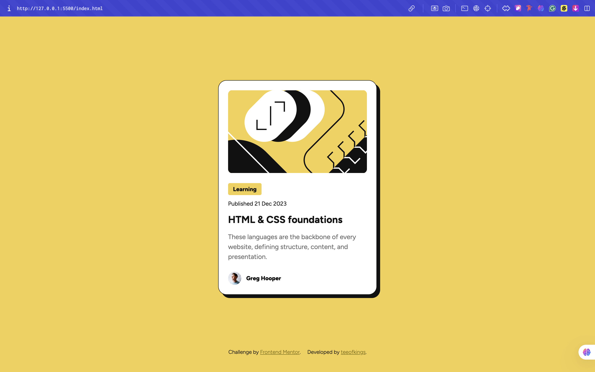

# Frontend Mentor - Blog preview card solution

This is a solution to the [Blog preview card challenge on Frontend Mentor](https://www.frontendmentor.io/challenges/blog-preview-card-ckPaj01IcS). Frontend Mentor challenges help you improve your coding skills by building realistic projects. 

## Table of contents

- [Overview](#overview)
  - [The challenge](#the-challenge)
  - [Screenshot](#screenshot)
  - [Links](#links)
- [My process](#my-process)
  - [Built with](#built-with)
  - [What I learned](#what-i-learned)
  - [Continued development](#continued-development)
  - [Useful resources](#useful-resources)
- [Author](#author)
- [Acknowledgments](#acknowledgments)

## Overview

### The challenge

Users should be able to:

- See hover and focus states for all interactive elements on the page

### Screenshot

### Links

- Solution URL: (https://www.frontendmentor.io/solutions/blog-preview-card-UVMsi5V_wO)
- Live Site URL: (https://blog-preview-component-steel.vercel.app)

## My process

Planned the layout, built semantic HTML, styled with flex and grid, added hover effects, inner strokes, and drop shadows. Made it responsive using media queries, then tested across screen sizes for polish.

### Built with

- HTML
- CSS

### What I learned

Built a fully responsive blog card using semantic HTML, flex and grid layouts, hover effects, and shadows.

### Continued development

Going forward, I plan to explore more advanced responsive techniques, interactive animations, and reusable card components for larger projects.

## Author

- Website - Timothy Ezeigbo
- Frontend Mentor - [@teeofkings](https://www.frontendmentor.io/profile/Teeofkings)
- Twitter - [@teeofkings](https://www.twitter.com/teeofkings)

## Acknowledgments

Thank you Frontend Mentor
